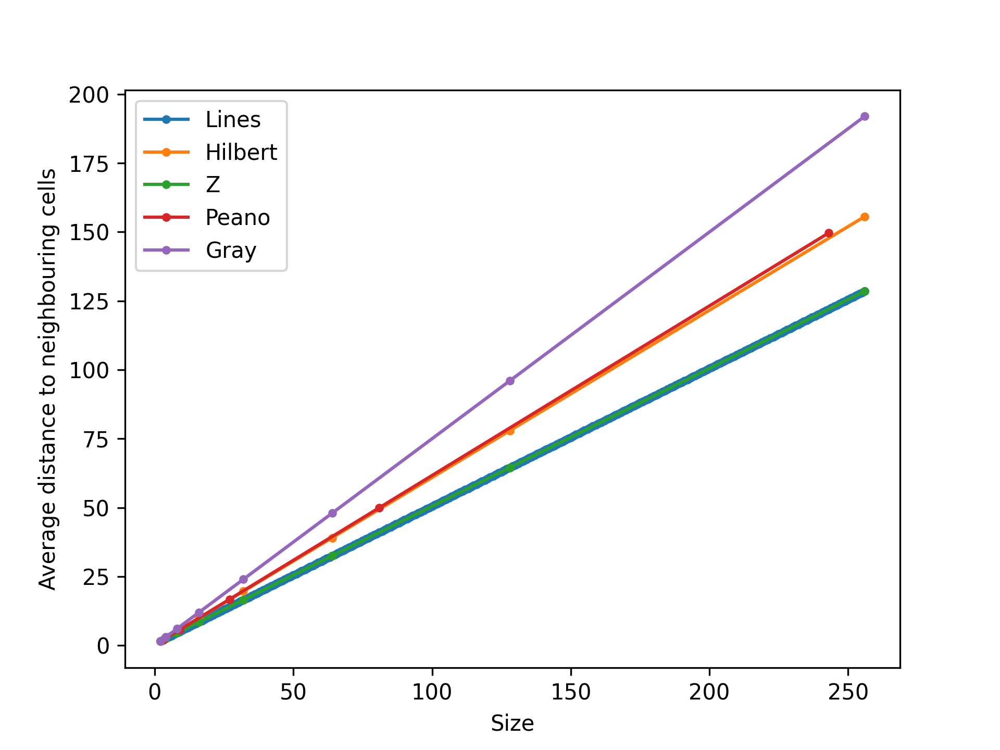

# space-filling-curve-intradistances
calculating and plotting the average distance from one cell to the next with various space filling curves

## plot of size (side length of square which shall be tiled) vs distance

## examples of the curves used
*size means iterations/depth in this context, not side length*

